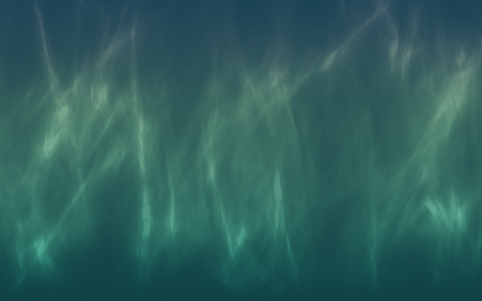
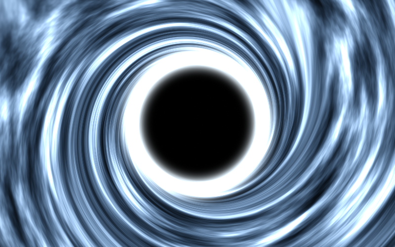
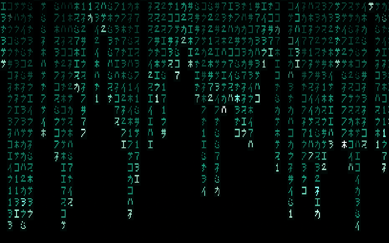
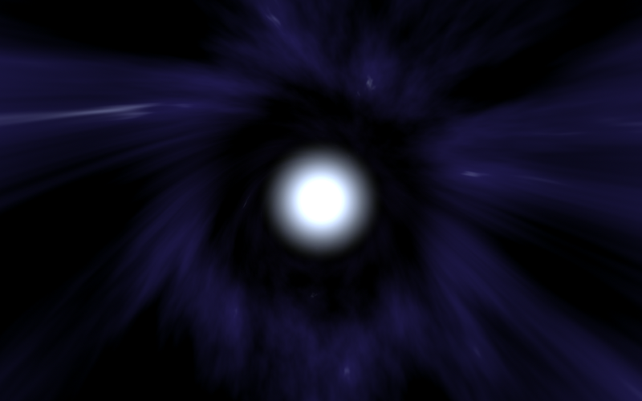
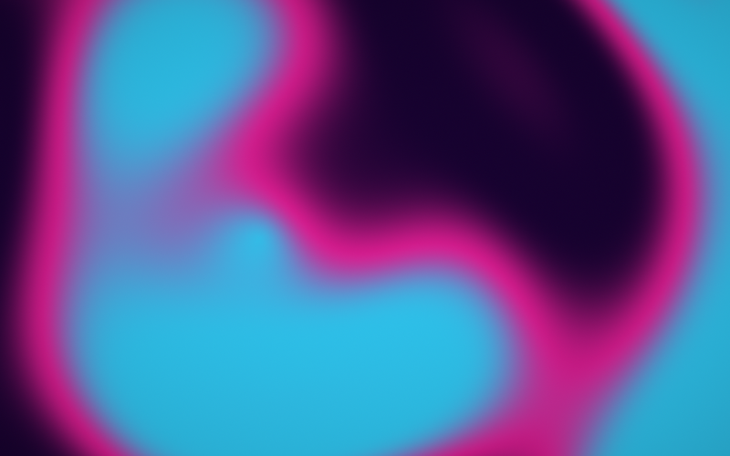
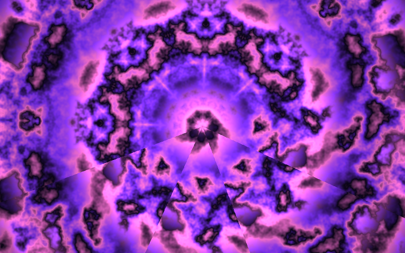
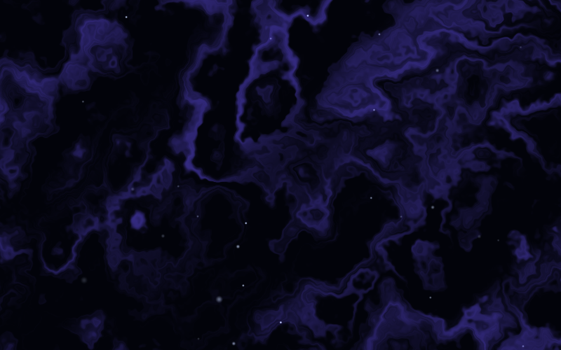

# Noctura

**A cross-platform animated screensaver — 13 GPU-rendered scenes, 13 color palettes — for macOS and Windows.**

Noctura runs the *same* scenes everywhere, three ways: a desktop gallery app, a native macOS `.saver`, and a native Windows `.scr`. Every scene is a real-time GPU fragment shader (WebGL on the web build, Metal on macOS, Direct3D 11 on Windows), kept at pixel-level parity across all three.



---

## ⬇️ Download

Grab the latest build from the [**Releases**](../../releases/latest) page.

| Platform | File | Notes |
|---|---|---|
| **macOS** (Apple Silicon) | `Noctura_<ver>_aarch64.dmg` | Smallest; M-series Macs |
| **macOS** (Intel + Apple Silicon) | `Noctura_<ver>_universal.dmg` | Works on any Mac |
| **macOS screensaver** | `Noctura.saver.zip` | Installs into System Settings → Screen Saver |
| **Windows** (x64 + ARM64) | `Noctura-Windows.zip` | Installer auto-detects your CPU; includes both builds |

> Builds are unsigned. macOS: right-click → Open the first time. Windows: SmartScreen → More info → Run anyway.

---

## ✨ Scenes

Aurora Drift · Northern Lights · Deep Space · Particle Drift · Plasma Field · Matrix Rain · Fireflies · Black Hole · Hyperspace Tunnel · Synthwave · Kaleidoscope · Caustics · Polar Clock

<p>






</p>

Each scene is tunable: **Style** (13 palettes), **Speed**, **Intensity**, **Density**, **Size**, and a **Performance** mode (Auto / Full / Balanced / Power Saver) that scales render resolution to stay smooth on any GPU.

---

## 🖥️ Three builds, one gallery

| Build | Tech | What it is |
|---|---|---|
| **Desktop app** | Tauri 2 · React · WebGL | A standalone window with the full gallery, slideshow, favorites, and clock overlay. |
| **macOS `.saver`** | Swift · Metal | A true system screensaver in System Settings → Screen Saver. See [`native-saver/`](native-saver/). |
| **Windows `.scr`** | Rust · Direct3D 11 | A true Windows screensaver (`/s` `/p` `/c`), ~200 KB, no runtime to install. See [`windows-saver/`](windows-saver/). |

The macOS Metal shader and the Windows HLSL shader are faithful ports of the same canonical scene shader, sharing an identical uniform layout — so all three platforms render the same image.

---

## 🔧 Build from source

**Prerequisites:** [Bun](https://bun.sh), [Rust](https://rustup.rs).

### Desktop app (macOS / Windows / Linux)
```bash
bun install
bun run tauri build          # → src-tauri/target/release/bundle/
```
macOS Universal:
```bash
rustup target add x86_64-apple-darwin
bun run tauri build --target universal-apple-darwin
```

### macOS screensaver (`.saver`)
```bash
cd native-saver
./build.sh --install         # builds + installs into ~/Library/Screen Savers/
```

### Windows screensaver (`.scr`)
Native on Windows:
```powershell
cd windows-saver
cargo build --release --target x86_64-pc-windows-msvc
```
Or cross-compile from macOS/Linux (no Windows box needed):
```bash
cargo install --locked cargo-xwin
rustup target add x86_64-pc-windows-msvc aarch64-pc-windows-msvc
cd windows-saver && ./build-cross.sh    # → dist/windows/
```

---

## 📁 Layout

```
src/             Web gallery (React + WebGL scenes)
src-tauri/       Tauri desktop app shell (Rust)
native-saver/    macOS .saver (Swift + Metal)
windows-saver/   Windows .scr (Rust + Direct3D 11)
screenshots/     Scene captures
```

## 📄 License

MIT — see [LICENSE](LICENSE). Created by Andre Hall.
