<div align="center">

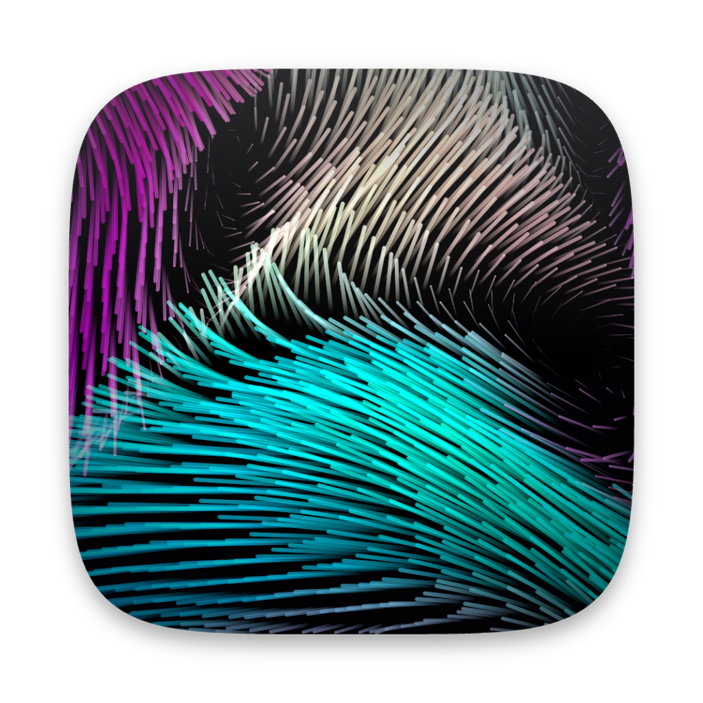

# Noctura

**Living GPU art for your idle screen.**
11 curated scenes · 13 color styles · macOS + Windows · free & open source

[](../../releases/latest)
[](../../actions)
[](../../releases)
[](LICENSE)
[](../../stargazers)
[](../../commits/main)
<br>


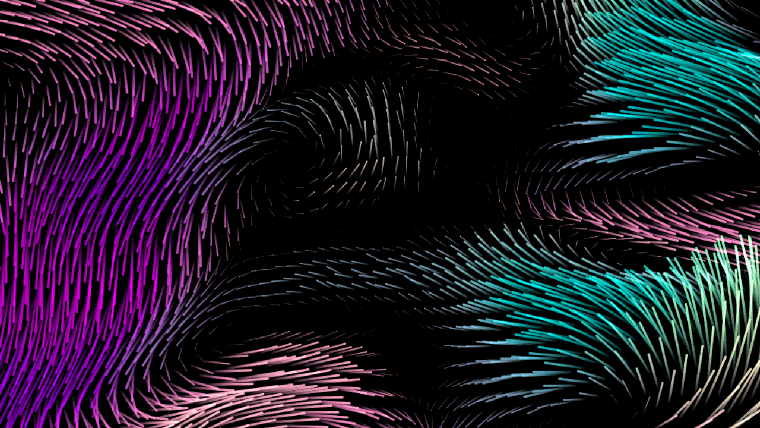

*Flux Drift — thousands of luminous blades riding a real Navier–Stokes fluid simulation, live on your GPU.*

</div>

Noctura is a native screensaver for **macOS** (`.saver`) and **Windows** (`.scr`), plus a desktop gallery app — the *same* scenes everywhere, rendered by Metal, Direct3D 11, and WebGL at full parity. No Electron in your lock screen, no runtime to install, a few hundred kilobytes of native code. It adapts its resolution to your GPU, throttles itself on battery, and updates in place.

---

## ⬇️ Download

Grab the latest build from the [**Releases**](../../releases/latest) page.

| Platform | File | Notes |
|---|---|---|
| **Windows** (x64 + ARM64) | `NocturaSetup.exe` | Real install wizard — auto-detects your CPU, registers in Apps & features, upgrades replace old versions |
| **macOS screensaver** | `Noctura-<ver>.pkg` | Native installer — installs for all users and cleans up old copies automatically |
| **macOS app** (Intel + Apple Silicon) | `Noctura_<ver>_universal.dmg` | Styled drag-to-Applications DMG; the app self-updates from GitHub Releases |
| **macOS app** (Apple Silicon only) | `Noctura_<ver>_aarch64.dmg` | Smaller download for M-series Macs |
| **Windows** (zip, advanced) | `Noctura-Windows.zip` | Raw `.scr` + install/uninstall scripts, if you prefer no installer |

> Builds are unsigned (ad-hoc signed, no paid Developer ID), so the OS warns on first launch — you can still open them:
> - **macOS:** drag Noctura to Applications, double-click, click **Done** on the warning, then **System Settings → Privacy & Security** → scroll to *"Noctura was blocked"* → **Open Anyway**. Guaranteed alternative: `xattr -dr com.apple.quarantine /Applications/Noctura.app`.
> - **Windows:** SmartScreen → **More info → Run anyway**.

### Updating & uninstalling
- **Upgrades are clean by design:** `NocturaSetup.exe` and the `.pkg` replace any previous version (including removing orphaned copies), and the macOS app offers one-click self-updates from this repo's releases.
- **Uninstall on Windows:** *Settings → Apps → Noctura → Uninstall*.
- **Uninstall the macOS screensaver:** delete `/Library/Screen Savers/Noctura.saver` (or `~/Library/Screen Savers/Noctura.saver` for zip-era installs).
- **Uninstall the macOS app:** drag `Noctura.app` from Applications to the Trash.

---

## ✨ Scenes

11 curated scenes — **Flux Drift** · Northern Lights · Deep Space · Particle Drift · Plasma Field · Fireflies · Black Hole · Caustics · Nebula Drift · Fractal Bloom · **Particle Swarm**

**Flux Drift** is the flagship scene: a **faithful port of [Flux](https://flux.sandydoo.me/)** (sandydoo's open-source tribute to the macOS Drift screensaver), rebuilt from its source. A real GPU **Stable-Fluids** simulation (Jos Stam Navier–Stokes, 128² grid) runs at true 60 Hz; thousands of line "blades" — one per 15 logical pixels of your display — chase the fluid with damped-spring physics, and even their *colors* have inertia, smoothed by a second spring from the local flow velocity. Lines accumulate in linear color space with a final sRGB encode, exactly like the reference's rendering pipeline.

Each scene below is shown in a **different one of the 13 color Styles**, to hint at the range — every scene works with every palette.

<p>
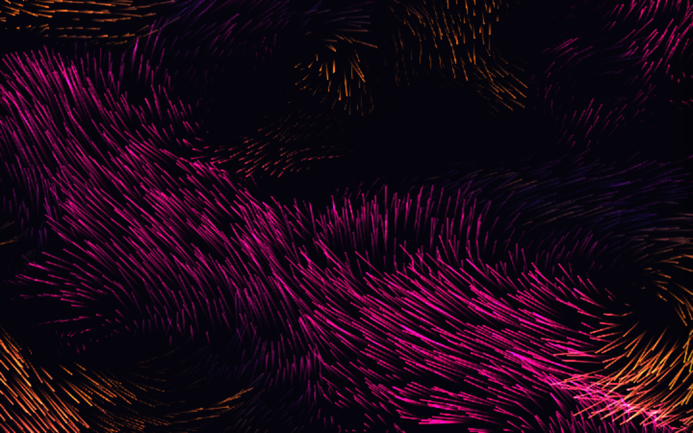
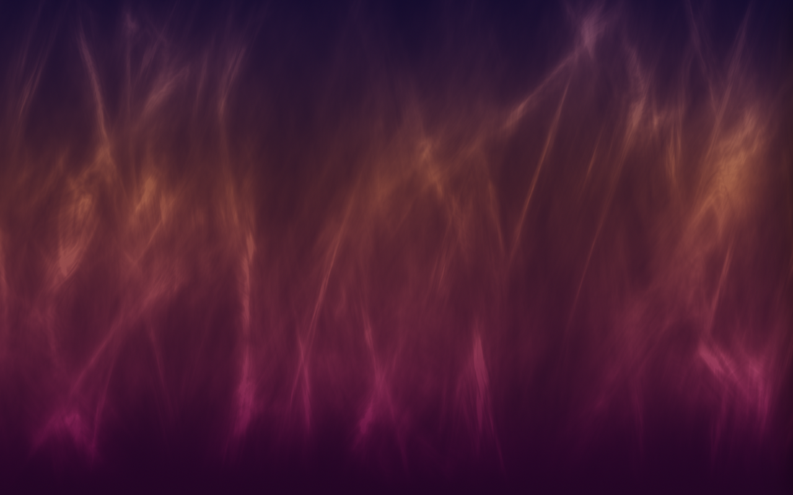
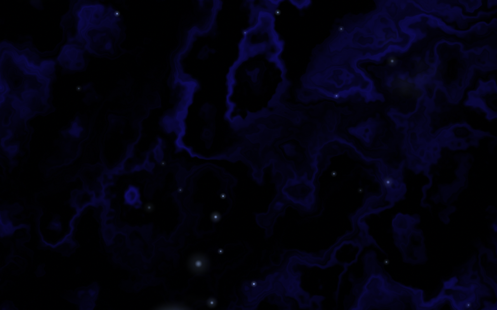
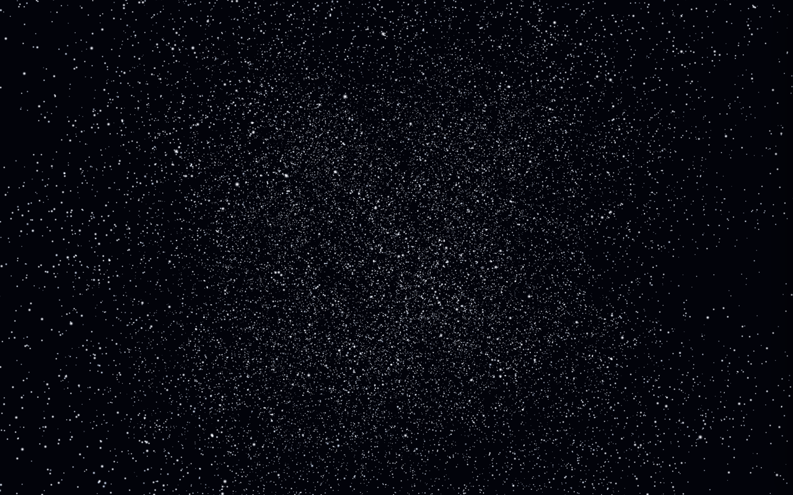
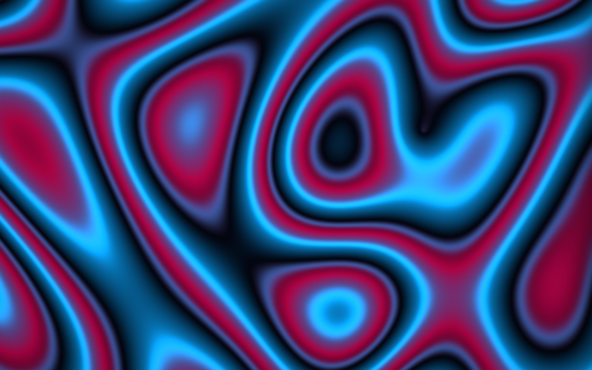
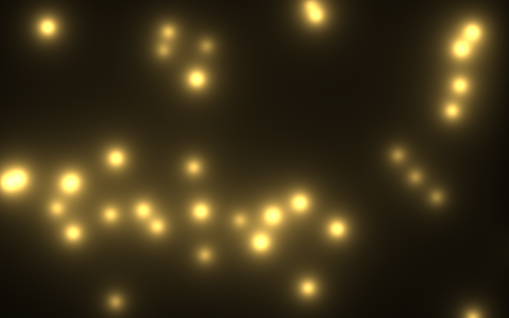
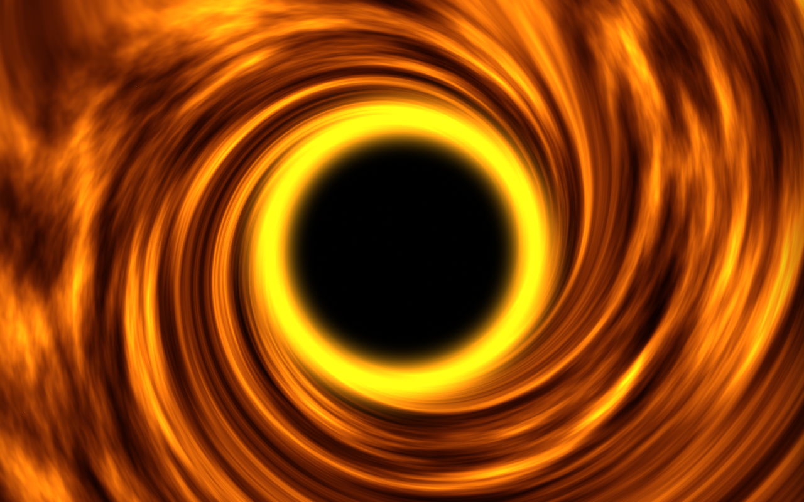
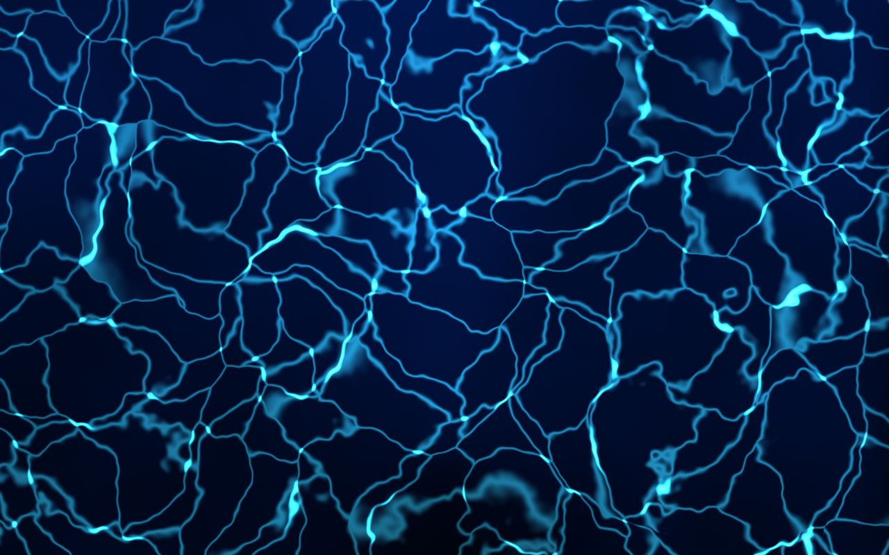
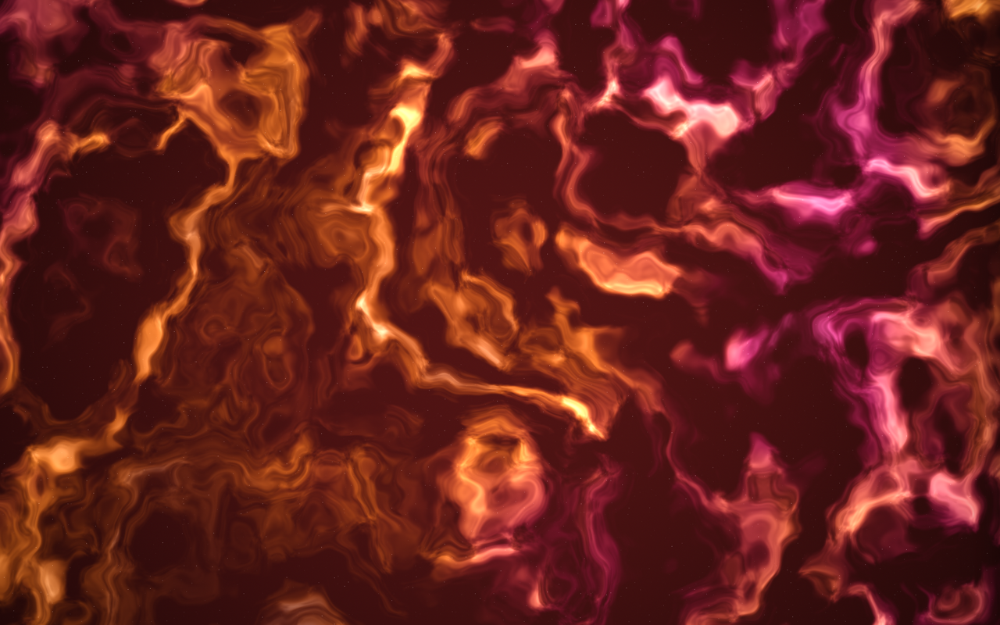
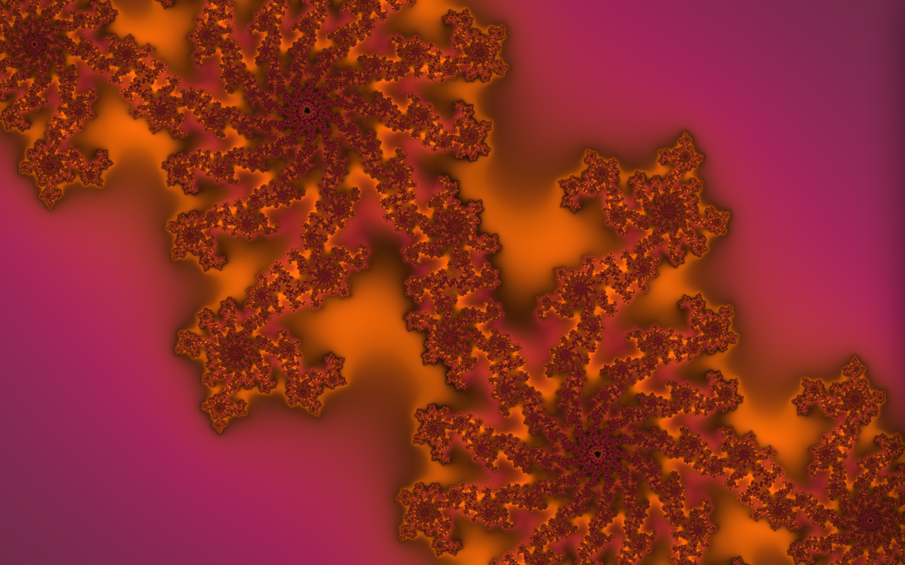
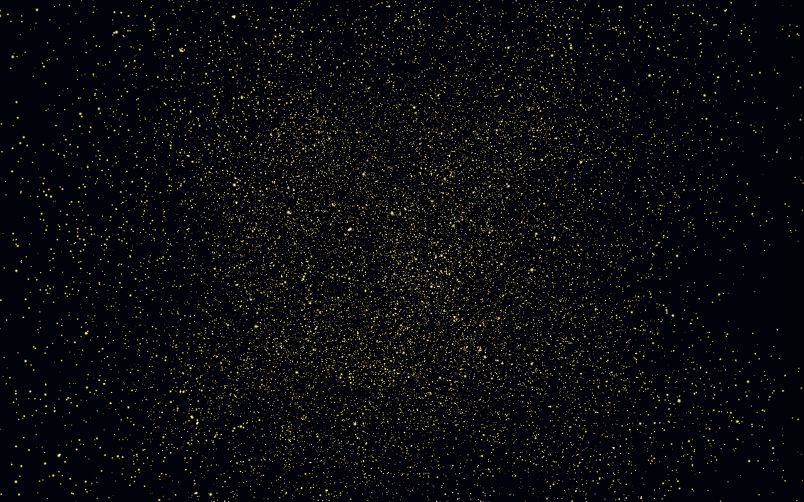
</p>

Each scene is tunable: **Style** (13 palettes — Aurora, Borealis, Deep Space, Ocean, Ember, Synthwave, Sunset, Nebula, Mint, Gold, Ice, Rose, Monochrome), **Speed**, **Intensity**, **Density**, **Size**, and a **Performance** mode (Auto / Full / Balanced / Power Saver) that scales render resolution to stay smooth on any GPU.

### 🕒 Clock & lock

All three builds can overlay the **time** (or **time + date**) on top of the scene — choose a typeface (**Light · Modern · Bold · Mono**, mapped to each OS's best modern system font), a position (**Center · Top · Bottom · Corner**), and **12- or 24-hour** format.

<p>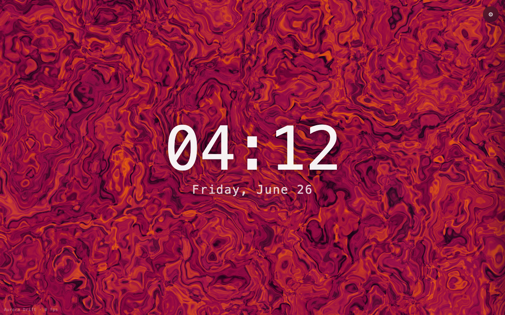</p>

**Lock on resume:** require sign-in when the screensaver ends. On **Windows** this is a one-click toggle in the saver's settings. On **macOS** it's an OS-owned setting a screensaver can't change itself — enable **System Settings → Lock Screen → "Require password after screen saver begins" → Immediately** and macOS locks automatically the moment the screensaver starts; the saver's Options sheet points you there.

---

## 🖥️ Three builds, one gallery

| Build | Tech | What it is |
|---|---|---|
| **Desktop app** | Tauri 2 · React · WebGL | The full gallery: browse scenes, tune them live, slideshow, favorites, clock overlay — and signed in-place self-updates. |
| **macOS `.saver`** | Swift · Metal | A true system screensaver in System Settings → Screen Saver. See [`native-saver/`](native-saver/). |
| **Windows `.scr`** | Rust · Direct3D 11 | A true Windows screensaver (`/s` `/p` `/c`) in a single ~400 KB binary, no runtime to install. See [`windows-saver/`](windows-saver/). |

The macOS Metal shader and the Windows HLSL shader are faithful ports of the same canonical scene shader, sharing an identical uniform layout — so all three platforms render the same image. **Flux Drift** goes further: all three renderers run the same multi-pass architecture ported from the Flux source — a 128² Navier-Stokes solver stepped at a fixed 60 Hz, a per-line state pass carrying 12 floats of spring physics per blade (endpoint, velocity, color, color-velocity, width) in MRT float textures, an endpoint pass with Flux's blend-compensation trick, and linear-space accumulation with an sRGB encode — so the fluid look **and motion** match across web, macOS, and Windows (verified against the live reference with side-by-side captures and motion-decorrelation measurement).

---

## 🔧 Build from source

**Prerequisites:** [Bun](https://bun.sh), [Rust](https://rustup.rs).

### Desktop app (macOS / Windows / Linux)
```bash
bun install
bun run tauri build          # → src-tauri/target/release/bundle/
```
macOS Universal:
```bash
rustup target add x86_64-apple-darwin
bun run tauri build --target universal-apple-darwin
```

### macOS screensaver (`.saver`)
```bash
cd native-saver
./build.sh --install         # builds + installs into ~/Library/Screen Savers/
```

### Windows screensaver (`.scr`)
Native on Windows:
```powershell
cd windows-saver
cargo build --release --target x86_64-pc-windows-msvc
```
Or cross-compile from macOS/Linux (no Windows box needed):
```bash
cargo install --locked cargo-xwin
rustup target add x86_64-pc-windows-msvc aarch64-pc-windows-msvc
cd windows-saver && ./build-cross.sh    # → dist/windows/
```

---

## 📁 Layout

```
src/             Web gallery (React + WebGL scenes)
src-tauri/       Tauri desktop app shell (Rust)
native-saver/    macOS .saver (Swift + Metal)
windows-saver/   Windows .scr (Rust + Direct3D 11)
screenshots/     Scene captures
```

## 📄 License

MIT — see [LICENSE](LICENSE). Created by Andre Hall.
